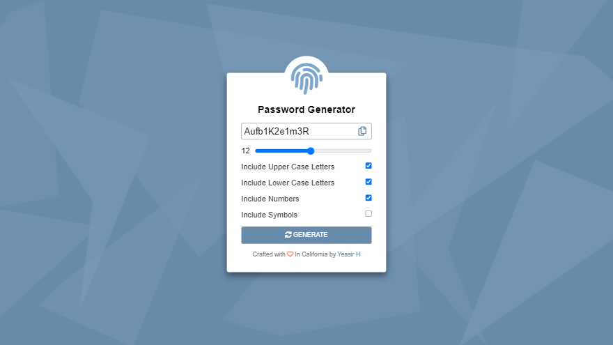

## Password Generator
A web app used to generate random passwords between 1-32 characters. 

The user will be prompted to choose from the following password options.
- Lower Case Letters
- Upper Case Letters
- Numbers
- Symbols

If there are no options selected, the generator will return an empty string.

### Weblink
https://yeasir01.github.io/password-generator/

### Technologies Used
- Font Awesome Library
- Vanilla Javascript
- HTML
- CSS

### Project Version
- 2.0

### Disclaimer
This tool is meant purely for educational purposes. It uses JavaScript `Math.random()` to generate "random" characters. Use at your own risk. Please visit https://developer.mozilla.org/en-US/docs/Web/JavaScript/Reference/Global_Objects/Math/random for more information.
